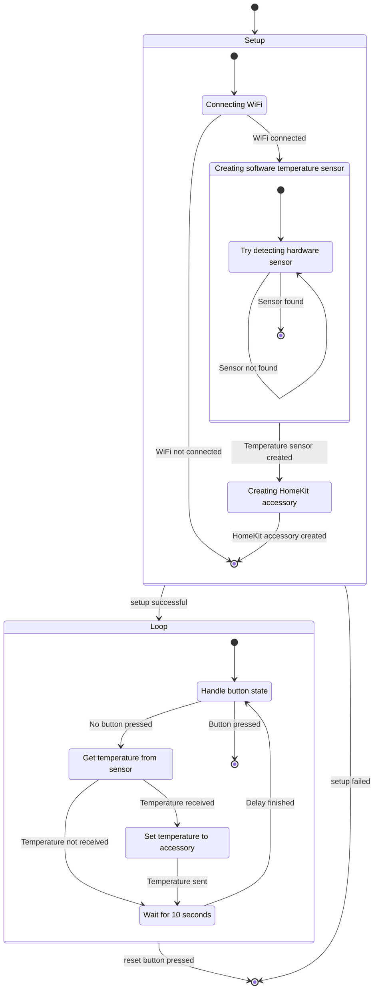

Temperature sensor
==================

This temperature sensor measure the temperature and publishes it as a HomeKit accessory. A button is provided to reset the connections to existing controllers (like an iPhone or a HomeKit concentrator).

This temperature sensor uses these components:
- ESP32-DevKitM-1.
- DS18B20.
- A resistor.
- A button.

## States

