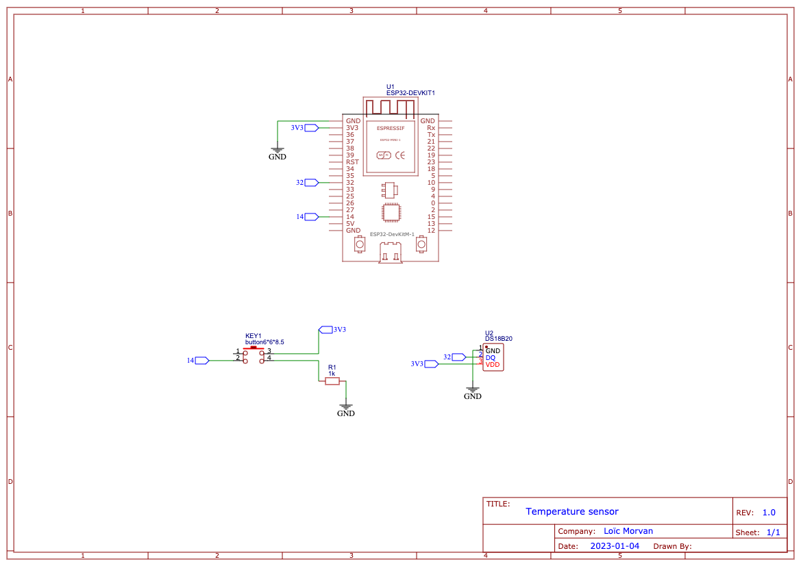
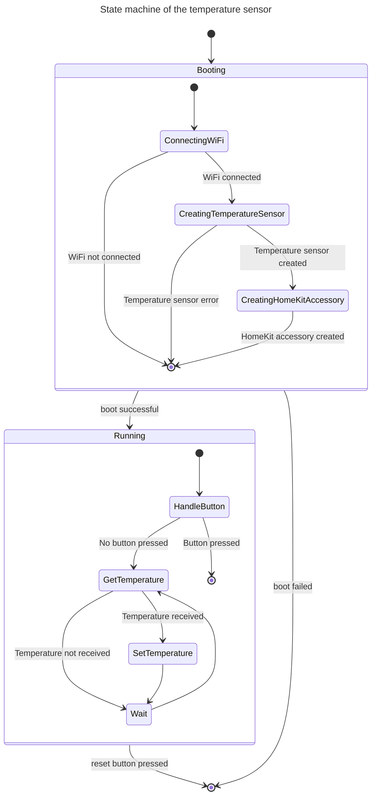

Temperature sensor
==================

This temperature sensor measure the temperature and publishes it as a HomeKit accessory. A button is provided to reset the connections to existing controllers (like an iPhone or a HomeKit concentrator).

This temperature sensor uses these components:
- ESP32-DevKitM-1.
- DS18B20.
- A resistor.
- A button.

## States

- Booting: the temperature sensor tries to connect to the WiFi, then creates the driver for the DS18B20 sensor and declares the accessory to the HomeKit system.
- Running: Reads the state of the _reset button_, read the temperature and publishes the value to the HomeKit accessory.
